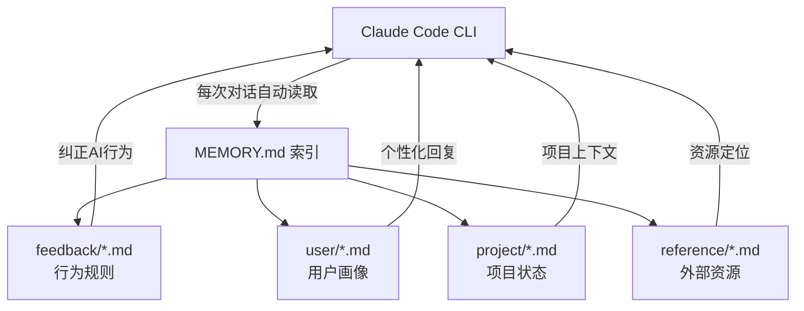

# Claude Code Memory System — 使用文档

> 让 Claude Code 真正记住你：从零搭建持久化、分层、可版本管理的 AI 记忆系统。


---

## 这是什么

Claude Code 自带一个基于文件的持久化记忆系统，但默认没有结构。这个仓库记录了一套实际运行的记忆架构：

- **14 个记忆文件**分四类管理（user / feedback / project / reference）
- 每次对话结束后自动更新，跨 session 保持一致
- 按版本 tag 备份，升级前可以随时回滚
- **V2 升级计划**：引入 TencentDB Agent Memory 的分层思路（L0-L3）+ Mermaid 短期记忆压缩

---

## 目录

```
claude-memory-guide/
├── README.md                        ← 本文件
├── architecture/
│   ├── v1-overview.md               ← V1 架构说明（file-based）
│   └── v2-layered-plan.md           ← V2 升级计划（分层 + Mermaid）
├── examples/
│   ├── feedback/                    ← 真实运行的 feedback 规则示例（已脱敏）
│   │   ├── feedback_trading_discipline.md
│   │   ├── feedback_unicode_paths.md
│   │   ├── feedback_split_adjustment.md
│   │   ├── feedback_research_first.md
│   │   └── feedback_negotiation.md
│   └── templates/                   ← 各类型记忆文件的空白模板
│       ├── template_user.md
│       ├── template_feedback.md
│       ├── template_project.md
│       └── template_reference.md
└── MEMORY_INDEX_template.md         ← MEMORY.md 索引模板
```

---

## 快速开始

### 1. 找到你的 memory 目录

```bash
# Claude Code 的 memory 目录在这里（路径因项目而异）
ls ~/.claude/projects/<your-project-hash>/memory/
```

### 2. 创建 MEMORY.md 索引

```bash
touch ~/.claude/projects/<your-project-hash>/memory/MEMORY.md
```

MEMORY.md 是 Claude Code 每次对话都会自动读取的入口文件，格式见 [MEMORY_INDEX_template.md](./MEMORY_INDEX_template.md)。

### 3. 按类型创建记忆文件

四种类型的文件模板在 `examples/templates/` 目录下：

| 类型 | 用途 | 触发时机 |
|------|------|---------|
| `user` | 你是谁、你的偏好、技术背景 | 第一次对话时建立，之后持续补充 |
| `feedback` | 你纠正过 AI 的行为规则 | 每次说"不要这样做"或"以后记住" |
| `project` | 进行中的项目状态 | 项目有新进展时更新 |
| `reference` | 外部资源的位置（文档/链接/工具） | 发现重要资源时记录 |

---

## V1 架构：file-based memory



**优点：** 零配置，直接用 Markdown 文件，Git 原生版本管理  
**缺点：** 无自动压缩，长项目后 MEMORY.md 会变大；无语义检索，靠关键词匹配

---

## V2 计划：分层记忆 + Mermaid 压缩

受 [TencentDB Agent Memory](https://github.com/TencentDB/agent-memory) 启发，V2 将引入：

### 分层长期记忆（L0-L3）

```
L0  原始对话片段        ← 不直接放进 memory，存外部文件
L1  原子事实           ← "用户用 Python，偏好 FastAPI"
L2  场景块             ← "用户在做量化项目时偏好用 WRDS 数据"
L3  用户偏好/技术风格   ← 当前 feedback/*.md 的位置
```

每条 L3 结论都可以追溯到 L2 场景块 → L1 原子事实 → L0 原始对话，证据链完整不断裂。

### Mermaid 短期记忆压缩

长任务（如调试 bug）中，把线性工具调用日志压缩为 Mermaid 任务状态图：


效果：同等信息量下 token 消耗减少约 60%。

详细升级方案见 [architecture/v2-layered-plan.md](./architecture/v2-layered-plan.md)。

---

## 版本历史

| 版本 | 日期 | 说明 |
|------|------|------|
| v1.0 | 2026-06-04 | 初始版本：file-based，14个记忆文件，四类型结构 |
| v2.0 | 计划中 | 分层 L0-L3 + Mermaid 短期记忆压缩 |

---

## 参考资料

- [Claude Code 官方文档](https://docs.anthropic.com/en/docs/claude-code)
- [TencentDB Agent Memory](https://github.com/TencentDB/agent-memory) — 启发 V2 分层设计
- [Anthropic Memory 系统说明](https://docs.anthropic.com/en/docs/claude-code/memory)
