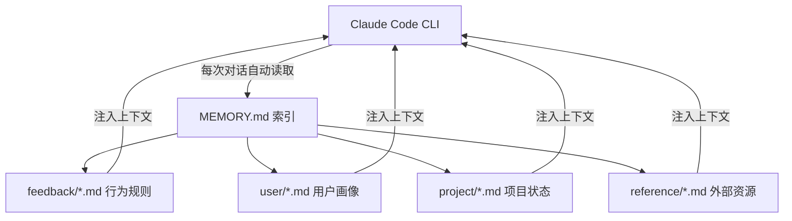
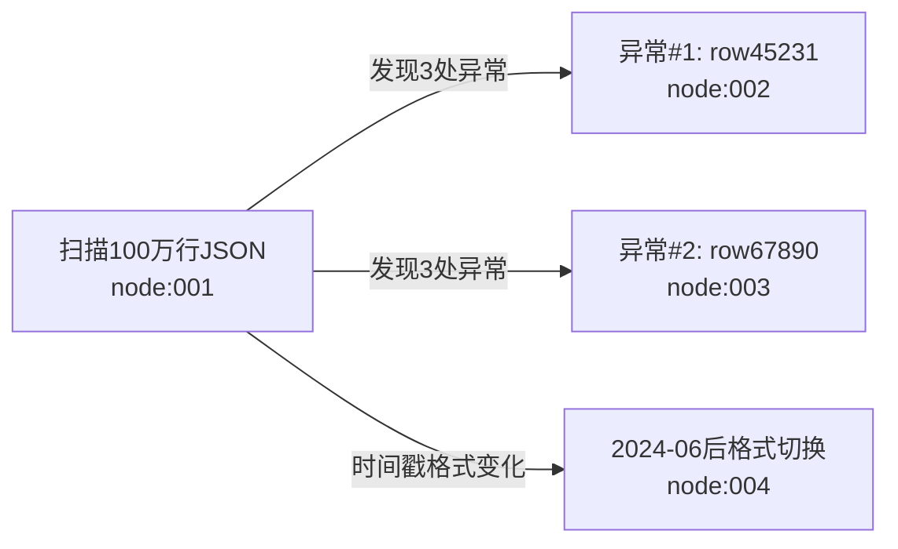

# Claude Code Memory System — 使用文档

> 让 Claude Code 真正记住你：从零搭建持久化、分层、可版本管理、有证据链的 AI 记忆系统。


---

## 这是什么

Claude Code 自带一个基于文件的持久化记忆系统，但默认没有结构。这个仓库记录了一套**实际运行中的 V2 记忆架构**：

- **L0-L3 分层结构**：每条行为规则都能追溯到原始证据，不是空中楼阁
- **Mermaid 短期记忆**：长任务状态压缩为图，节省约 60% token
- **4类记忆文件**（user / feedback / project / reference）+ 场景块（L2）+ 原子事实（L1）
- **Git 版本管理**：v1.0 / v2.0 tag，升级前随时回滚

---

## 目录

```
claude-memory-guide/
├── README.md                        ← 本文件（含横向对比 + 混合方案）
├── architecture/
│   ├── v1-overview.md               ← V1 架构说明（file-based）
│   └── v2-layered-plan.md           ← V2 架构（分层 + Mermaid + Source链）
├── examples/
│   ├── feedback/                    ← 真实运行的 feedback 规则示例（已脱敏）
│   └── templates/                   ← 各类型记忆文件的空白模板
└── MEMORY_INDEX_template.md         ← MEMORY.md 索引模板
```

---

## 快速开始

### 1. 找到你的 memory 目录

```bash
ls ~/.claude/projects/<your-project-hash>/memory/
```

### 2. 创建 MEMORY.md 索引

MEMORY.md 是 Claude Code 每次对话都会自动读取的入口文件：

```bash
touch ~/.claude/projects/<your-project-hash>/memory/MEMORY.md
```

格式见 [MEMORY_INDEX_template.md](./MEMORY_INDEX_template.md)。

### 3. 按类型创建记忆文件

| 类型 | 用途 | 触发时机 |
|------|------|---------|
| `user` | 你是谁、你的偏好、技术背景 | 第一次对话时建立，持续补充 |
| `feedback` | 你纠正过 AI 的行为规则 | 每次说"不要这样做"或"以后记住" |
| `project` | 进行中的项目状态 | 项目有新进展时更新 |
| `reference` | 外部资源的位置 | 发现重要资源时记录 |

---

## 架构概览

### V1：file-based memory（基础版）



### V2：分层记忆（当前版本）


**V2 核心改进：**
- 每条 L3 规则都有 `Source:` 字段追溯到 L2 场景 → L1 事实 → L0 原始对话
- `current_task.md` 用 Mermaid 图追踪长任务状态，不存原始日志

---

## 横向对比：这套系统 vs 主流方案

### 对比对象

| 项目 | Stars | 核心定位 |
|------|-------|---------|
| **本系统 V2** | — | 结构化分层记忆，手动策划，证据链完整 |
| [claude-mem](https://github.com/thedotmack/claude-mem) | 80K+ | 全自动捕获，SQLite+向量搜索，Web UI |
| [TencentDB Agent Memory](https://github.com/TencentDB/agent-memory) | 4.6K+ | OpenClaw 插件，符号化短期记忆+分层长期记忆 |

---

### 我们领先的地方

#### ✅ 1. L0-L3 完整证据链（claude-mem 和 TencentDB 都没有）

claude-mem 捕获的是**时间线式 observations**，知道"发生了什么"，但不知道"为什么这条规则成立"。TencentDB 有分层但缺少可手动维护的 Source 追溯。

我们的每条 L3 规则都有完整的向下追溯：

```
feedback_split_adjustment.md（L3）
  ↓ Source 链接
scene_quant_data.md（L2 场景块）
  ↓ 原子事实索引
facts_quant.md#nvda-split-2024（L1 原子事实）
  ↓ 原始存档
L0_archive/2026_06_04.md（L0 原始对话）
```

这意味着：**每条规则都能被质疑、被验证、被更新**，而不是一个黑盒。

#### ✅ 2. 领域场景块（L2）——按上下文组织，不是按时间

claude-mem 的检索是"搜索关键词/时间线"。我们有专门的场景文件，把同一个领域的所有相关知识聚合在一起：

```
L2_scenes/scene_quant_data.md
  → 包含：数据处理规则 + 入场流程 + 当前持仓上下文 + 原子事实索引
```

当 AI 进入量化相关任务时，一个文件就能提供完整的领域上下文，不需要跨文件检索拼凑。

#### ✅ 3. Mermaid 短期记忆压缩——应对大输出场景

当一次工具调用返回海量数据（如100万行JSON、大型日志文件）时，claude-mem 的设计是存储原始输出再压缩摘要——这本身代价就很高，且摘要容易丢失细节。

我们的 `current_task.md` 不存原始输出，直接提取关键发现写成 Mermaid 节点：



相同信息量，token 节省约 60%，且节点可按 ID 检索原始细节。

#### ✅ 4. 行为规则带结构化推理

claude-mem 和 TencentDB 存储的 observations 是描述性的，没有"为什么"和"边界条件"。

我们的每条 feedback 文件都有固定结构：

```markdown
规则本身（直接可执行）

**Why:** 触发这条规则的具体事件（有日期）

**How to apply:** 在哪些场景下激活，边界条件是什么
```

这让 AI 在遇到相似但不完全相同的场景时，能根据 Why 判断是否适用，而不是机械套用。

#### ✅ 5. Git 版本管理 + 私有/公开双仓库分离

- v1.0 / v2.0 tag，升级前一键回滚
- 敏感内容（个人信息、持仓数据）放私有仓库，架构文档和脱敏示例放公开仓库
- claude-mem 无版本快照，TencentDB 无内建隐私分层

---

### claude-mem 领先的地方（诚实说）

| 功能 | claude-mem | 本系统 |
|------|-----------|-------|
| 自动捕获工具调用输出 | ✅ 全自动 hooks | ❌ 手动写入 |
| 语义向量搜索 | ✅ Chroma 向量库 | ❌ 文件关键词匹配 |
| Web Viewer UI | ✅ localhost:37777 实时流 | ❌ 无 |
| 自然语言查询历史 | ✅ mem-search skill | ❌ 无 |
| 安装复杂度 | 一条命令 | 手动搭建 |

**核心差异：** claude-mem 解决"捕获"问题（不漏掉任何东西），我们解决"结构化"问题（让记住的东西真正可用）。

---

## 推荐方案：两者结合

claude-mem 和本系统不是竞争关系，**是互补的**。把 claude-mem 当 L0 的自动采集层，把本系统当 L1-L3 的结构化层：

```
┌─────────────────────────────────────────┐
│           claude-mem（自动捕获层）         │
│  Hooks 自动记录所有工具调用 → SQLite       │
│  = 我们的 L0 archive，什么都不会漏        │
└──────────────────┬──────────────────────┘
                   │ 定期人工蒸馏（或 hooks 触发）
                   ▼
┌─────────────────────────────────────────┐
│           本系统 L1-L3（结构化层）         │
│                                         │
│  L1 原子事实 ← 从 claude-mem 提炼重要发现  │
│  L2 场景块   ← 领域知识聚合              │
│  L3 行为规则 ← Why + How + 边界条件      │
│                                         │
│  + current_task.md（Mermaid 短期记忆）    │
└─────────────────────────────────────────┘
```

### 安装 claude-mem（一条命令）

```bash
npx claude-mem install
```

重启 Claude Code 即生效。

### 两层协作工作流

```
日常使用：
  claude-mem 自动在后台捕获一切 → 你不用做任何事

每周/重要任务结束后：
  打开 claude-mem Web UI（localhost:37777）
  → 找到重要发现
  → 手动提炼成 L1 原子事实或更新 L2 场景块
  → 下次 AI 就能直接用结构化版本，而不是搜索原始 observations

长任务（调试/大改动）：
  在对话开始时告诉 Claude：「用 current_task.md 追踪这个任务」
  → AI 在 current_task.md 里维护 Mermaid 状态图
  → 跨 session 可以直接接着做，节省约 60% token
```

### 分工总结

| 场景 | 用哪个 |
|------|-------|
| 找"上周我做了什么" | claude-mem 的 mem-search |
| 让 AI 下次记住某条规则 | 写进我们的 L3 feedback |
| 理解为什么有这条规则 | 查 L2 场景块 → L1 事实的 Source 链 |
| 跨 session 继续长任务 | current_task.md 的 Mermaid 图 |
| 大数据量工具调用结果 | 提炼 → L1 原子事实，不存原始输出 |

---

## 版本历史

| 版本 | 日期 | 说明 |
|------|------|------|
| v1.0 | 2026-06-04 | 初始版本：file-based，14个记忆文件，四类型结构 |
| v2.0 | 2026-06-05 | L0-L3分层 + Mermaid短期记忆 + Source追溯链 + 4个L2场景块 + 4个L1事实文件 |

---

## 参考资料

- [Claude Code 官方文档](https://docs.anthropic.com/en/docs/claude-code)
- [claude-mem](https://github.com/thedotmack/claude-mem) — 推荐配合使用：自动捕获层
- [TencentDB Agent Memory](https://github.com/TencentDB/agent-memory) — 启发 V2 分层和 Mermaid 压缩设计
- [Anthropic Memory 系统说明](https://docs.anthropic.com/en/docs/claude-code/memory)
