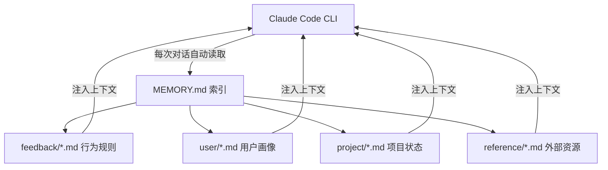
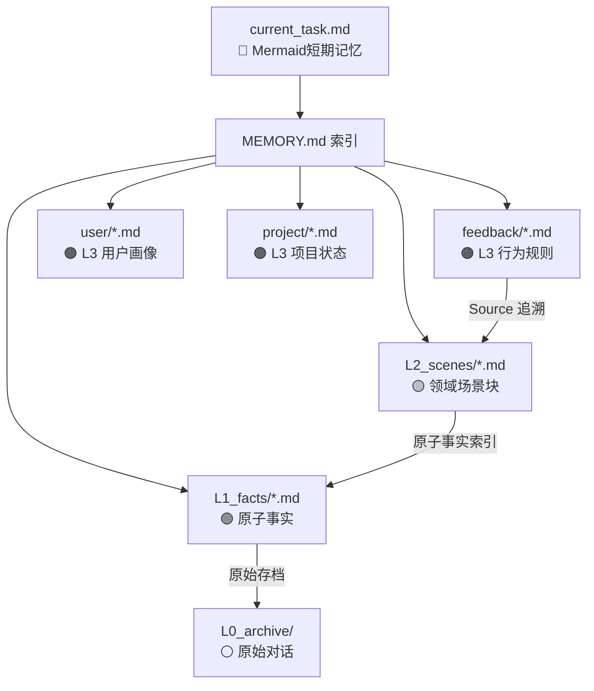
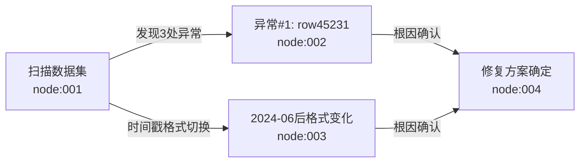

# Claude Code Memory System — 使用文档

> 让 Claude Code 真正记住你：从零搭建持久化、分层、可版本管理、有证据链的 AI 记忆系统。


---

## 这是什么

Claude Code 自带一个基于文件的持久化记忆系统，但默认没有结构。这个仓库记录了一套**实际运行中的 V2 记忆架构**：

- **L0-L3 分层结构**：每条行为规则都能追溯到原始证据，不是空中楼阁
- **Mermaid 短期记忆**：长任务状态压缩为状态图，节省约 60% token
- **4类记忆文件**（user / feedback / project / reference）+ 领域场景块（L2）+ 原子事实（L1）
- **Git 版本管理**：v1.0 / v2.0 tag，升级前随时回滚

---

## 目录

```
claude-memory-guide/
├── README.md                        ← 本文件（含横向对比 + 混合方案）
├── architecture/
│   ├── v1-overview.md               ← V1 架构说明（file-based）
│   └── v2-layered-plan.md           ← V2 架构（分层 + Mermaid + Source链）
├── examples/
│   ├── feedback/                    ← 真实运行的 feedback 规则示例（已脱敏）
│   └── templates/                   ← 各类型记忆文件的空白模板
└── MEMORY_INDEX_template.md         ← MEMORY.md 索引模板
```

---

## 快速开始

### 1. 找到你的 memory 目录

```bash
ls ~/.claude/projects/<your-project-hash>/memory/
```

### 2. 创建 MEMORY.md 索引

```bash
touch ~/.claude/projects/<your-project-hash>/memory/MEMORY.md
```

MEMORY.md 是 Claude Code 每次对话都会自动读取的入口文件，格式见 [MEMORY_INDEX_template.md](./MEMORY_INDEX_template.md)。

### 3. 按类型创建记忆文件

| 类型 | 用途 | 触发时机 |
|------|------|---------|
| `user` | 你是谁、你的偏好、技术背景 | 第一次对话时建立，持续补充 |
| `feedback` | 你纠正过 AI 的行为规则 | 每次说"不要这样做"或"以后记住" |
| `project` | 进行中的项目状态 | 项目有新进展时更新 |
| `reference` | 外部资源的位置 | 发现重要资源时记录 |

---

## 架构概览

### V1：file-based memory（基础版）



### V2：分层记忆（当前版本）



---

## 横向对比：这套系统 vs 主流方案

> **说明**：以下对比经过源码级验证（读取了 claude-mem 的数据库 schema、hooks 配置、observation 生成 prompt 和架构文档），不是基于 README 推断。

### 对比对象

| 项目 | Stars | 核心机制 |
|------|-------|---------|
| **本系统 V2** | — | 人工策划的分层结构，带 Source 追溯链 |
| [claude-mem](https://github.com/thedotmack/claude-mem) | 80K+ | hooks 自动捕获，SQLite + Chroma 向量搜索，Web UI |
| [TencentDB Agent Memory](https://github.com/TencentDB/agent-memory) | 4.6K+ | OpenClaw 插件，符号化压缩 + 分层长期记忆 |

---

### 关于 claude-mem 的准确描述

先说清楚 claude-mem 实际是什么，避免误解：

claude-mem **不是**简单的文本日志。每条 observation 有以下结构化字段（来自数据库 schema）：

```sql
title      -- 简短标题
subtitle   -- 一句话说明（最多24词）
facts      -- 自包含的原子陈述列表（每条不含代词，可独立理解）
narrative  -- 完整叙述：做了什么、如何运作、为什么重要
concepts   -- 知识类型标签（how-it-works / why-it-exists / gotcha / pattern / trade-off 等）
type       -- bugfix / feature / refactor / change / discovery / decision
files_read / files_modified
```

此外 `session_summaries` 表还有 `investigated`、`learned`、`completed`、`next_steps` 等结构化摘要字段。

**结论**：claude-mem 有相当完善的结构化字段，`facts` 字段在概念上与我们的 L1 原子事实有重叠，`why-it-exists` 概念标签与我们的 Why 字段也有部分重叠。

---

### 我们真正领先的地方（源码验证后）

#### ✅ 1. L2 领域场景块——按领域聚合，不是按时间线

claude-mem 的所有 observations 按 session（时间线）组织。搜索时，你得到的是"这段时间发生了什么"，而不是"关于量化数据处理这个领域，我们积累了哪些知识"。

我们的 L2 场景块是**跨 session 的主题归纳**：

```
L2_scenes/scene_quant_data.md
  → 包含所有关于"WRDS数据处理"的知识：
    拆股调整规则 + 研报入场流程 + 持仓上下文 + 原子事实索引
```

进入相关任务时，一个文件提供完整领域上下文，不需要跨 session 搜索拼凑。claude-mem 没有等价机制。

#### ✅ 2. L3→L2→L1 Source 追溯链——规则可被质疑和验证

claude-mem 有引用 ID（可以通过 `GET /api/observation/{id}` 查到某条记录），但这是"向后查原始记录"，不是"向下追溯规则的来源证据"。

我们的 Source 链解决的是不同问题：

```
feedback_split_adjustment.md（L3：规则）
  ↓ Source: [[scene_quant_data]]
scene_quant_data.md（L2：场景块）
  ↓ [[facts_quant#nvda-split-2024]]
facts_quant.md（L1：原子事实）
  ↓ 原始对话
L0_archive/（L0：存档）
```

**为什么重要**：当 AI 遇到边界情况时，能通过 Source 链判断规则的来源和适用条件，而不是盲目套用。claude-mem 无此结构。

#### ✅ 3. Mermaid 短期记忆——应对大数据量工具调用

claude-mem 的设计是"捕获工具调用输出 → AI 压缩成 observation"。当一次工具调用返回海量数据（如扫描100万行 JSON）时，这个流程本身代价就很高，且 AI 摘要容易丢失关键细节。

我们的 `current_task.md` 不存原始输出。直接提取关键发现写成 Mermaid 节点，节点有 ID 可按需检索原始细节：



相同信息量，token 节省约 60%。claude-mem 无此机制。

#### ✅ 4. Feedback 规则：设计用于 AI 决策，不只是搜索

claude-mem 的 observations 设计目标是**可搜索的历史记录**，让你知道"过去发生了什么"。

我们的 feedback 文件设计目标是**AI 行为规范**，让 Claude 在下次遇到相似场景时知道"该怎么做，为什么，边界在哪里"：

```markdown
规则（直接可执行）

**Why:** 触发这条规则的具体事件（帮助判断相似情况是否适用）

**How to apply:** 在哪些场景下激活，边界条件是什么
```

这两种结构服务的是不同用途：一个是检索系统，一个是行为规范系统。

#### ✅ 5. Git 版本快照 + 双仓库隐私分层

- v1.0 / v2.0 tag，每次重大升级前备份，随时回滚
- 敏感内容放私有仓库，架构文档和脱敏示例放公开仓库

claude-mem 有 `<private>` 标签（排除某内容不进存储），但没有版本快照和仓库级隐私分层。

---

### claude-mem 领先的地方（同样诚实说）

| 功能 | claude-mem | 本系统 |
|------|-----------|-------|
| 自动捕获所有工具调用 | ✅ 6个生命周期 hooks，全自动 | ❌ 手动写入 |
| 语义向量搜索 | ✅ Chroma 向量数据库 | ❌ 文件关键词匹配 |
| Web Viewer UI | ✅ 实时内存流可视化 | ❌ 无 |
| 自然语言查询历史 | ✅ mem-search skill | ❌ 无 |
| 安装复杂度 | `npx claude-mem install` 一行 | 需手动搭建 |
| 社区维护 | ✅ 80K+ stars，活跃迭代 | 个人维护 |

**核心差异**：claude-mem 解决"不漏掉任何东西"（自动捕获），我们解决"让记住的东西真正可用"（结构化 + 行为规范）。两者互补，不冲突。

---

## 推荐方案：配合使用

```
┌──────────────────────────────────────────┐
│         claude-mem（自动捕获层）            │
│  6个 hooks 自动记录所有工具调用 → SQLite    │
│  = 充当我们的 L0 archive                   │
└──────────────────┬───────────────────────┘
                   │ 定期人工蒸馏（或 hooks 触发）
                   ▼
┌──────────────────────────────────────────┐
│         本系统 L1-L3（结构化层）            │
│                                          │
│  L1 原子事实  ← 从 claude-mem 提炼重要发现  │
│  L2 场景块   ← 领域知识跨 session 归纳     │
│  L3 行为规则 ← Why + How + 边界条件        │
│                                          │
│  + current_task.md（Mermaid 短期记忆）     │
└──────────────────────────────────────────┘
```

### 安装 claude-mem

```bash
npx claude-mem install
```

重启 Claude Code 即生效，此后在后台静默运行。

### 分工

| 场景 | 用哪个 |
|------|-------|
| 找"上周我做了什么" | claude-mem 的 mem-search 或 Web UI |
| 让 AI 下次记住某条规则 | 写进本系统的 L3 feedback |
| 理解为什么有这条规则 | 查 Source 链：L3 → L2 → L1 |
| 跨 session 继续长任务 | current_task.md 的 Mermaid 图 |
| 大数据量工具调用结果 | 提炼关键发现 → L1 原子事实 |

---

## 版本历史

| 版本 | 日期 | 说明 |
|------|------|------|
| v1.0 | 2026-06-04 | 初始版本：file-based，14个记忆文件，四类型结构 |
| v2.0 | 2026-06-05 | L0-L3分层 + Mermaid短期记忆 + Source追溯链 + L2场景块 + L1原子事实 |

---

## 参考资料

- [Claude Code 官方文档](https://docs.anthropic.com/en/docs/claude-code)
- [claude-mem](https://github.com/thedotmack/claude-mem) — 推荐配合使用：自动捕获层（源码已验证）
- [TencentDB Agent Memory](https://github.com/TencentDB/agent-memory) — 启发 V2 分层和 Mermaid 压缩设计
- [Anthropic Memory 系统说明](https://docs.anthropic.com/en/docs/claude-code/memory)
