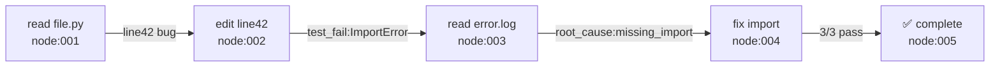
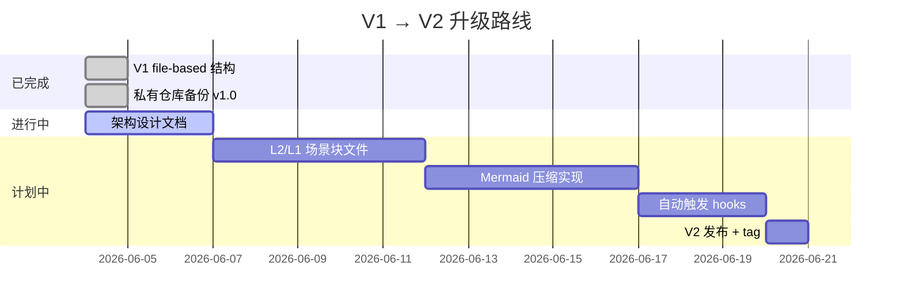

# V2 升级计划：分层记忆 + Mermaid 压缩

> 受 [TencentDB Agent Memory](https://github.com/TencentDB/agent-memory) 启发  
> 状态：设计中（2026-06-04）

---

## 核心改进

### 改进一：L0-L3 分层长期记忆

**问题：** V1 中所有记忆平级存放，结论无法追溯，"用户偏好 TypeScript"这个结论从哪来的不清楚。

**解法：** 四层分层，每条结论有完整证据链。

```
L3  用户偏好/技术风格      ← 当前 feedback/*.md 的位置（保持不变）
 ↑  可追溯到
L2  场景块                 ← "在量化项目中，用户发现用 DlyRet 比 DlyClose 准确"
 ↑  可追溯到
L1  原子事实               ← "2026-06-04，用户报告 NVDA 数据异常，根因是拆股未调整"
 ↑  可追溯到
L0  原始对话片段           ← 存外部文件，不进主上下文
```

**V2 文件结构新增：**

```
memory/
├── MEMORY.md              ← 只放 L3（不变）
├── feedback_*.md          ← L3（不变）
├── user_*.md              ← L3（不变）
├── project_*.md           ← L3（不变）
├── L2_scenes/             ← 新增：场景块
│   └── scene_quant_data_handling.md
├── L1_facts/              ← 新增：原子事实（自动生成）
│   └── facts_2026_06.md
└── L0_archive/            ← 新增：原始对话片段（压缩存档）
    └── 2026_06_04.md
```

**追溯示例：**

```markdown
# feedback_split_adjustment.md（L3）
WRDS 跨期比较涨跌幅必须用 DlyRet，不能用 DlyClose。
Source: [[scene_quant_data_handling]] → [[facts_2026_06#nvda-split]]
```

---

### 改进二：Mermaid 短期记忆压缩

**问题：** 长任务（调试、多步骤分析）中，工具调用历史线性堆积，token 消耗快。

**解法：** 把完整工具调用日志卸载到外部文件，用 Mermaid 语法生成紧凑的任务状态图放进上下文。

**原来（线性，高 token）：**
```
Step 1: Read file.py → found bug on line 42
Step 2: Edit line 42 → test failed  
Step 3: Read error log → found import issue
Step 4: Fix import → test passed
Step 5: Read test results → 3 tests pass
```

**V2（Mermaid，低 token）：**


每个节点有 ID（node:001 等），需要细节时通过 ID 检索原始日志，不需要时保持紧凑。

**实测效果（TencentDB 数据）：**
- token 节省：最高 61%
- 任务准确率：提升 64.2%

---

### 改进三：自动触发更新

**V1 问题：** 需要用户手动说"记住这件事"。

**V2 方案：** 在 Claude Code hooks 中配置，每次对话结束自动判断是否有新信息需要写入：

```json
// .claude/settings.json
{
  "hooks": {
    "PostToolUse": [
      {
        "matcher": ".*",
        "hooks": [
          {
            "type": "command",
            "command": "python3 ~/.claude/memory_updater.py --check"
          }
        ]
      }
    ]
  }
}
```

---

## 升级路线



---

## 与 TencentDB Agent Memory 的关系

TencentDB Agent Memory 是一个 **OpenClaw 插件**，需要 OpenClaw 框架才能运行，**无法直接安装到 Claude Code CLI**。

但它的**设计思路**可以在 Claude Code 的文件系统中手动实现：

| TencentDB 方案 | Claude Code 等价实现 |
|---------------|-------------------|
| SQLite + sqlite-vec 向量存储 | 文件系统 + 手动分层（V2 计划中） |
| 自动 L0-L3 提取 | 对话结束后手动/hooks 触发 |
| Mermaid 状态图生成 | 手动在任务开始时建 Mermaid 模板 |
| OpenClaw 插件接口 | Claude Code hooks（PostToolUse）|

完整自动化版本需要自己写 Python 脚本接入 hooks，V2 会提供参考实现。
